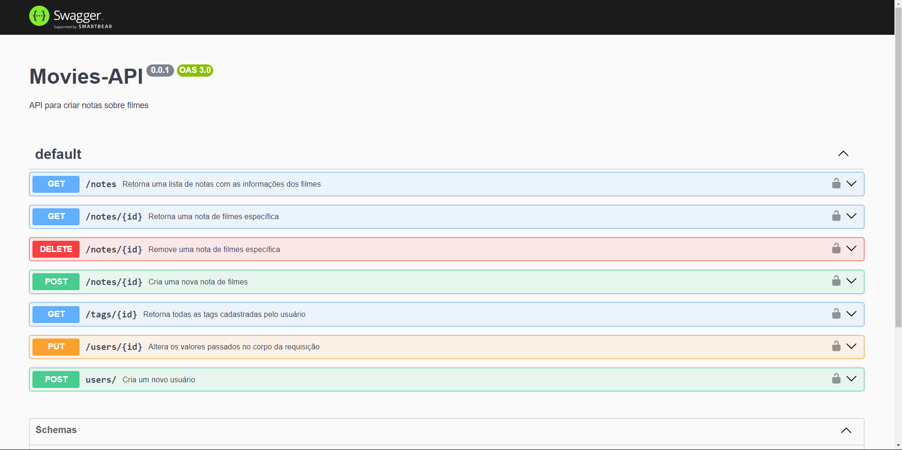

Status: Completo 🚀

## Moviesnotes api
Movies Notes é uma API que gerencia o cadastro e a atualização de usuários, além de permitir a criação de notas e tags para os filmes cadastrados nele.

## Tecnologias Utilizadas:
 * NodeJS
 * Express
 * Knex
 * Bcryptjs
<hr/>

## Documentação
 <div> 
 Acesse a documentação para ter acesso aos caminhos da API: /api-docs
   
## Instalação
  * Faça um clone do repositório do projeto no GitHub.
  * Navegue até o diretório do projeto.
  * Execute o seguinte comando para instalar as dependências: 

```
$ npm install
```

## Running the project
```
$ npm run dev
$ npm run migrate
```

